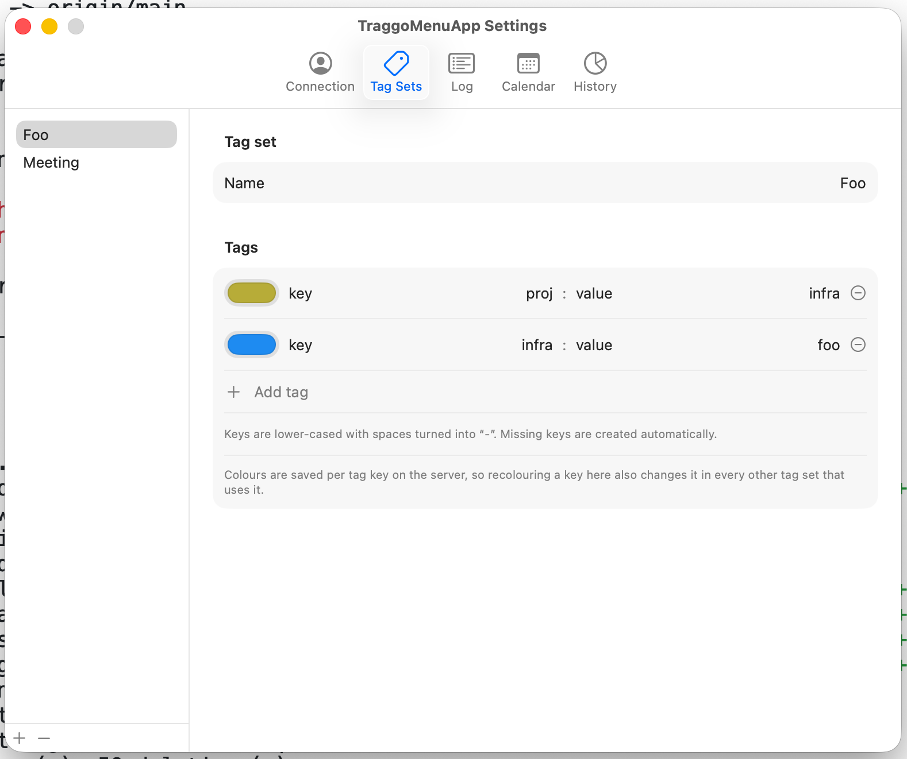

# TraggoMenuApp

A macOS menu bar app for managing [Traggo](https://github.com/traggo/server) tagged timespans.

Start and stop time tracking from the menu bar, then review and edit your history with log, calendar, and chart views — all backed by your own Traggo server.


## Requirements

- macOS 14 (Sonoma) or later
- A user account on a running [Traggo server](https://github.com/traggo/server)

## Features

### Tag Sets & quick tracking

Define custom Tag Sets, then start and stop timespans with those tags in a couple of clicks from the menu bar drop-down.



### Log View

An editable view of your previous timespans. Add tags and notes, or adjust start/end times after the fact.


### Calendar View

Visualize your timespans across days and weeks.


### History View

Visualize your timespans across Tags and Tag Sets.


## Authentication

Sign in with your Traggo username and password and the app registers itself as a standard Traggo "Device" — the same mechanism the Traggo web UI uses. The resulting device token is stored in the macOS Keychain, and all authentication flows through your Traggo server. Your password is never stored.

## Installation

There is no official build pipeline yet, so the only way to install is to clone the repo and build from source:

```sh
git clone <this repo>
cd TraggoMenuApp
swift build
./.build/debug/TraggoMenuBar
```

Because the resulting binary is unsigned, macOS will prompt you to allow it access to your Keychain (where the device token is stored). If there's community interest in this project, a signed release build will be the first thing we prioritize.

## Development

A `justfile` is included for the edit-build-run loop:

```sh
just run-dev
```

It codesigns the debug binary with a local `TraggoMenuApp Dev` certificate so that Keychain access survives rebuilds. Create a self-signed certificate with that name in Keychain Access if you want the same behavior.

### Remove local data and get a "Fresh Install"

`rm -rf ~/Library/Application\ Support/TraggoMenuBar && defaults delete TraggoMenuBar`
