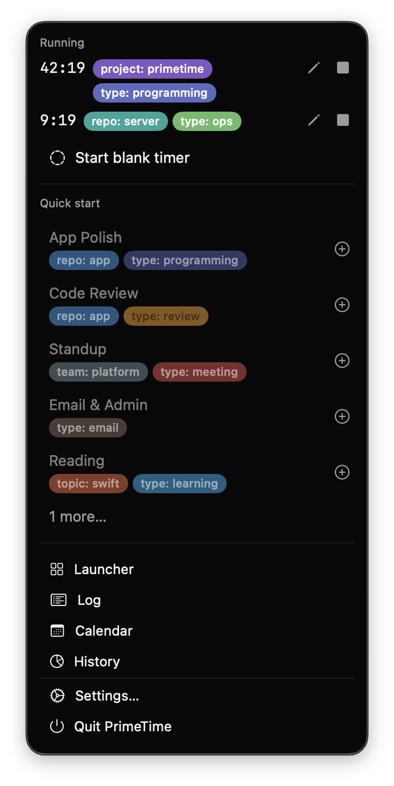
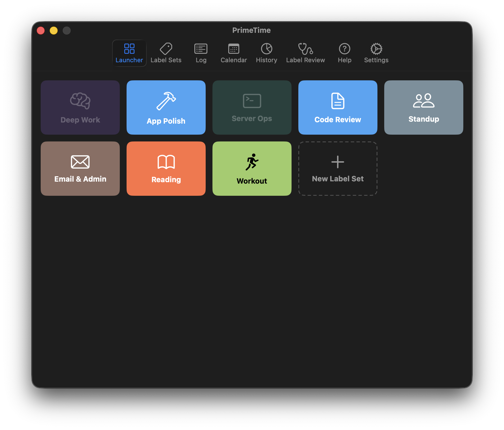
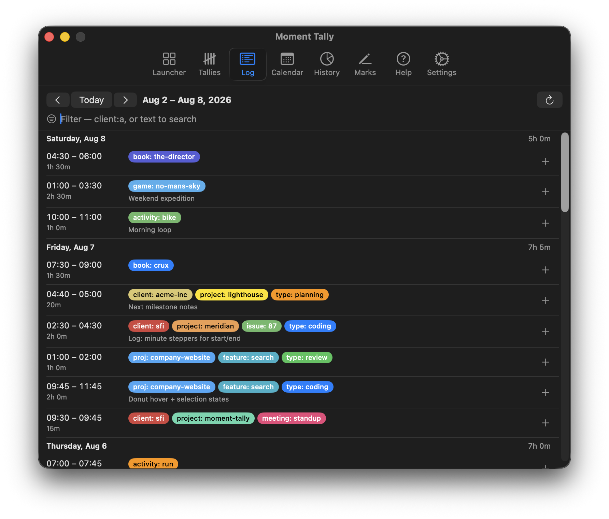
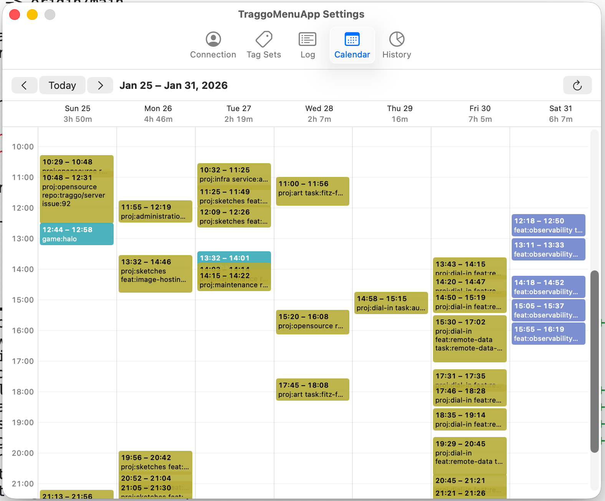
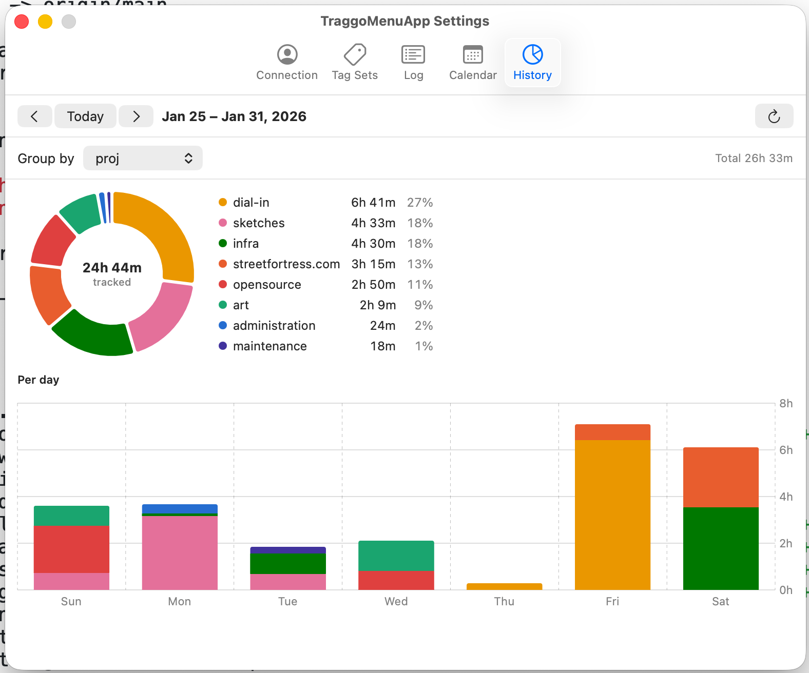
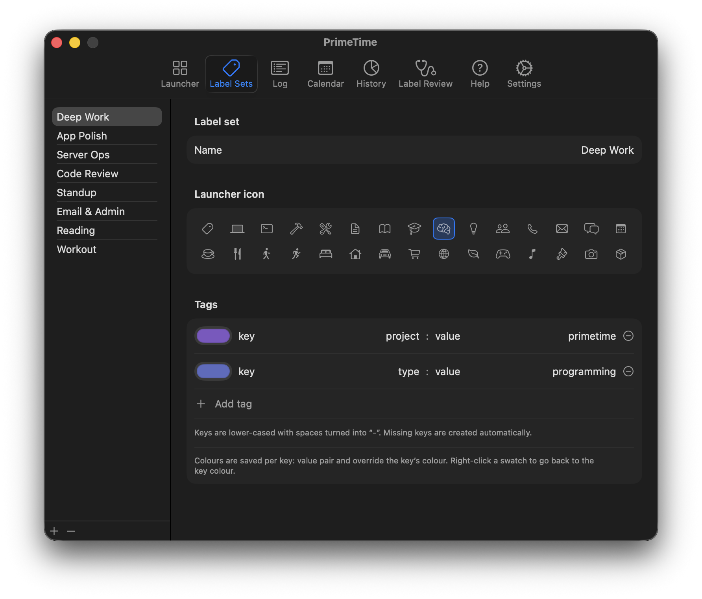
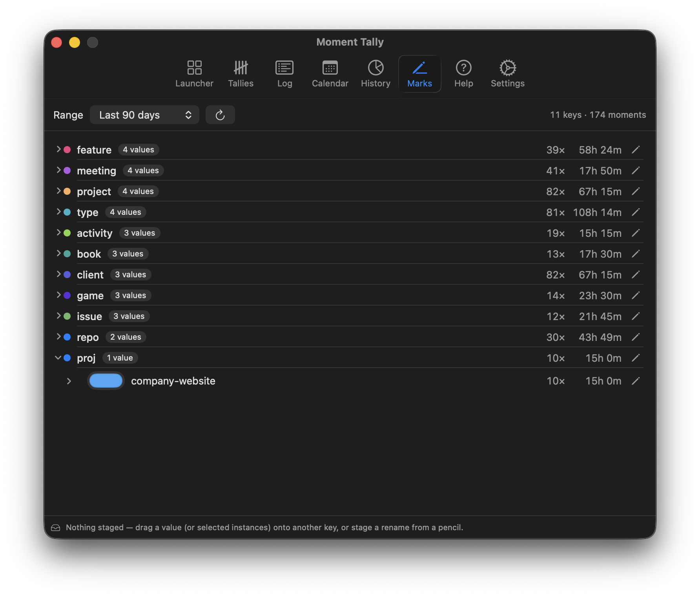

# PrimeTime

**Your time, dimensioned.**

PrimeTime is a macOS menu-bar time tracker that marks and divides your time exactly how you want. Attach `key: value` labels to every span — inspired by Prometheus metrics — and your time becomes queryable data, not entries filed into one rigid hierarchy. Start a timer in one keystroke, run several at once, then see where the day actually went. Offline-first: no account, no server, no network required.

<p align="center">
  
</p>

## Time, measured on your terms

- **Mark and divide time exactly how you want** — flexible `key: value` labels (`repo: app`, `type: review`, `team: platform`) make your time queryable across any axis you invent, without deciding a hierarchy up front.
- **Multi-task in the modern era** — multiple concurrent timers, flexible after-the-fact editing, and note-taking, because real work overlaps, gets interrupted, and needs correcting.
- **Visualize your workday** — see where the day actually went in calendar and chart views built from your own labels.
- **Own your data** — everything lives in a local SQLite store on your Mac. Sync is optional and goes through a server you host.

## A look inside

### Launcher

Saved label sets as one-click cards — icons and colors for the way you actually organize work. Sets that are already running light up.



### Log

An editable record of your time: days, entries, notes, and running totals — nothing hidden. Adjust start/end times, labels, and notes after the fact.



### Calendar

Your week laid out hour by hour. Overlapping timers share columns, so multi-tasking is visible instead of hidden.



### History

Donut and per-day charts over any grouping — and a second grouping to compare against, so "time by type" and "time by repo" sit side by side.



### Label Sets

Define the sets behind the launcher cards and the popover's quick start: a name, an icon, and the `key: value` pairs to apply. Colors are saved per key, with per-value overrides.



### Label Review

Vocabulary drifts — one week says `project`, a stray day says `proj`. Label Review shows every key and value with usage counts, and cleans up drift with a drag or a rename.



## Try it: Demo Mode

Every screenshot above is Demo Mode — a seeded, throwaway copy of the app's data with a week of realistic history and two running timers. It can't touch real data: it lives in its own `demo.sqlite` (rebuilt on every launch) and a scratch settings domain.

```sh
git clone <this repo>
cd PrimeTime
swift build
./.build/debug/PrimeTime --demo
```

Look for the timer in the menu bar. Launch without `--demo` to start tracking for real.

## Install

- macOS 14 (Sonoma) or later

There is no signed release build yet — signing, notarization, and a Homebrew cask are on the roadmap (#34). Until then, install is clone-and-build, as above. The app stores sync credentials in the macOS Keychain, so when you connect a server the unsigned binary will ask for Keychain access.

## Sync with PrimeTime Server — optional

PrimeTime is local-first: the app is fully functional offline, and the local store stays the source of truth. When you want your history on more than one Mac — or shared across a team — run [PrimeTime Server](server/): a headless GraphQL backend, derived from [traggo/server](https://github.com/traggo/server) and evolved into the PrimeTime v1 API (label vocabulary, per-value colors, server-side label sets). It ships as a single container; SQLite is perfect for a personal server, Postgres for teams.

Connect in **Settings → Sync**: enter your server URL, sign in, and your local history uploads and stays in sync from then on.

## Import from Traggo

Coming from Traggo? **Settings → Import from Traggo** copies a Traggo server's full history — finished and running timespans, plus tag keys and their colors — into the local database. Safe to run again: already-imported timespans are updated, not duplicated.

## Development

A `justfile` is included for the edit-build-run loop:

```sh
just run-dev
```

It codesigns the debug binary with a local `TraggoMenuApp Dev` certificate so that Keychain access survives rebuilds. Create a self-signed certificate with that name in Keychain Access if you want the same behavior; plain `swift build` works fine otherwise (Demo Mode never touches the Keychain at all).

To remove local data and get a fresh install:

```sh
rm -rf ~/Library/Application\ Support/PrimeTime && defaults delete PrimeTime
```

## Naming & status

PrimeTime is mostly through its spin-out from its previous life as *TraggoMenuApp*: the target and executable are now `PrimeTime`, but a few "tag" strings linger in smaller UI copy while the vocabulary finishes moving to "label". Public distribution and JSON export land with phase 7 (#34). The server tree's provenance and licensing are documented in [server/README.md](server/README.md).

## License

[AGPL-3.0-or-later](LICENSE). The `server/` tree is derived from [traggo/server](https://github.com/traggo/server) and combines GPL-3.0 code with AGPL-3.0-or-later additions — see [NOTICE](NOTICE) and [server/NOTICE](server/NOTICE) for the structure.
